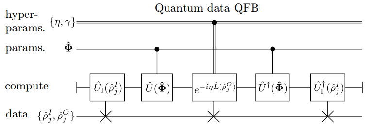
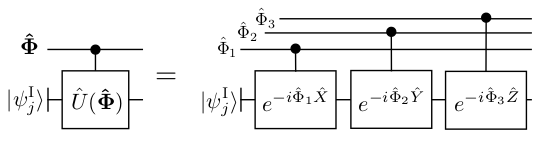

# Universal Quantum Parametric Learning - BaQProp
Here we provide an example of an application of the universal training algorithm proposed in our paper arxiv.org/abs/1806.09729 for 1 qubit data learning. The paper is a bit on the long side, in case of TL;DR here is a rough list of things that were introduced :

1. A general quantum backpropagation scheme (which we call BaQProp), which can be thought of as a way to embed loss function information in phases of a wavefunction of parameters. It is similar to classical backpropagation and is also applicable to quantum parametric circuits (Not just neural networks)

2. Two core optimization algorithms that use BaQProp, called MoMGrad and QDD. The first is a quantum-classical algorithm that uses parameter momentum information to recover gradients of the loss. The second is a purely quantum algorithm that allows us to optimize parameters, in some cases allowing for tunneling in the parameter landscape.

3. Ways to convert classical neural networks to quantum circuits (which can then be trained using the above algorithms)

4. Quantum data learning applications for parametric circuits (Unitary, Channel, State, and Measurement/POVM learning, error correcting code learning, quantum autoencoders, quantum GANs, etc.), which can be trained using above algorithms

5. Quantum meta learning strategies (using the above algorithms), and ways to parallelize and regularize the training when using the above optimization algorithms.

6. A general scheme for quantum-classical backpropagation of errors, allowing for the seamless training of hybrid networks made of parametric quantum circuits running on a quantum computer (classical or quantum data flows) and classical neural nets (classical data flows) running on a classical computer

We believe the tools and formalism introduced in the paper are very general and the unified framework for optimization of parametric networks on a quantum computer that was introduced is fairly valuable from a practical standpoint. Further design of novel quantum neural architectures and ansatze which use with this optimization framework are sure to yield exciting results. On top of this, the fact we can integrate these quantum optimization strategies into existing methods of classical deep learning (using our hybrid quantum-classical backpropagation) should be an interesting avenue of exploration for classical Deep Learning specialists looking to start leveraging quantum computers.

# Abstract
We introduce the Backwards Quantum Propagation of Phase errors (Baqprop) principle, a central theme upon which we construct multiple universal optimization heuristics for training both parametrized quantum circuits and classical deep neural networks on a quantum computer. Baqprop encodes error information in relative phases of a quantum wavefunction defined over the space of network parameters; it can be thought of as the unification of the phase kickback principle of quantum computation and of the backpropagation algorithm from classical deep learning. We propose two core heuristics which leverage Baqprop for quantum-enhanced optimization of network parameters: Quantum Dynamical Descent (QDD) and Momentum Measurement Gradient Descent (MoMGrad). QDD uses simulated quantum coherent dynamics for parameter optimization, allowing for quantum tunneling through the hypothesis space landscape. MoMGrad leverages Baqprop to estimate gradients and thereby perform gradient descent on the parameter landscape; it can be thought of as the quantum-classical analogue of QDD. In addition to these core optimization strategies, we propose various methods for parallelization, regularization, and meta-learning as augmentations to MoMGrad and QDD. We introduce several quantum-coherent adaptations of canonical classical feedforward neural networks, and study how Baqprop can be used to optimize such networks. We develop multiple applications of parametric circuit learning for quantum data, and show how to perform Baqprop in each case. One such application allows for the training of hybrid quantum-classical neural-circuit networks, via the seamless integration of Baqprop with classical backpropagation. Finally, for a representative subset of these proposed applications, we demonstrate the training of these networks via numerical simulations of implementations of QDD and MoMGrad.

# Requirements
To run this code you will need python 2.7. However the code can be easily modified to work on python3. You will need numpy, scipy, requests[security], pyquil, and grove from Rigetti. This can be done with

  ```$ pip install --user requests[security] numpy scipy pyquil quantum-grove```
  
pyquil and grove require python3 however it can be made to work with python2 by installing requests[security].

Finally you will also need to head over the Rigetti website: https://www.rigetti.com/forest and get yourself an API key (it's free) to be able to use their quantum simulator.

# Getting Started

Once you have signed up for Forest, registered your Forest API key with you config, and installed everything you should be able to run a simple test program such as:

```python

from pyquil.quil import Program
import pyquil.api as api
from pyquil.gates import *
qvm = api.QVMConnection()
p = Program()
p.inst(H(0), CNOT(0, 1))
    <pyquil.pyquil.Program object at 0x101ebfb50>
wavefunction = qvm.wavefunction(p)
print(wavefunction)
    (0.7071067812+0j)|00> + (0.7071067812+0j)|11>
 ```

# Description of the code
Now, you should have everything you need to be able to run the the code! All of the code and documentation is contained within  ``` MoMgrad.py ```. Running the file with ```$ python MoMGrad.py``` will launch a qvm connection to Rigetti's Forest api and begin the learning. The logic we follow in this example is the following:

1. We generate 20 random 1 qubit quantum states as our training data input. (to ML coders these are our X's).
2. We apply our "true" unitary to all samples in our training data input to get our training data output (our y's)
3. Prepare our circuit:
   1. We Create a circuit that prepares one of our sample quantum input states (X's)
   2. Then we applly our parameterized unitary (initially all oscillators at 0 mu and 1.0 sigma)
   3. Then we enact a phase gate that is parameterized by our desired output for that sample (the corresponding y)
   4. Then we uncompute our parameterized unitary from step ii) leaving us with our cost function in phase.
   5. Finally we measure the change of our oscillators which will be affected by the phase induced earlier
4. We then save this measurement for this circuit.
5. We repeat steps three and four, with our remaining samples with the same oscillator configuration.
6. We update the oscillators mu using the average of all 20 gradients (momentum) from step 5.
7. We update the oscillators sigma so that it decreases slightly from its previous value.
8. We return to step 1 until we have converged or reached some maximum number of iterations.


Loosely speaking we are using MoMGrad and the Principles of BaQProp to get our parameterized unitary as close as possible to what the initially unknown "true" unitary is. It is a use case of quantum data feedforward and backpropagation:



The specific structure we have for this case, is the following




What is presented in the code is not entirely identical as to what might happen on an ACTUAL chip implementing this algorithm, but for the sake of simulation and showcasing the logic, the results we get would be similar (minus overflow errors from simulating harmonic oscillators etc.).


# Notes
Parameters are restricted to being between the -3 and 3 range (since we use 3qubits only to simulate our oscillators, momentum terms can occasionally overflow this range). If you encounter a parameter set that does not learn very well it could very well be caused by an internal overflow in the simulator. This code was re-written from the original paper to be as user friendly as possible while showcasing the bare minimum functionality so people might extend / experiment with other ansatz or write their own versions. Feel free to report any bugs, submit new versions using different simulators or languages or fixes in the code etc! (maybe as a TODO: separate out the oscillator controlled gates in to it's own module ?)
